# Azure DP 203


## Notes certif DP 203


+ Once a database has been created by a Spark job, you can create tables in it with Spark that use Parquet as the storage format. Table names will be converted to lower case and need to be queried using the lower case name. These tables will immediately become available for querying by any of the Azure Synapse workspace Spark pools. They can also be used from any of the Spark jobs subject to permissions.

+ Supprimer efficacement des données par partitions : 

  + Creer une table vide temporaire
  + mettre les données à supprimer dedans
  + drop la table

+ 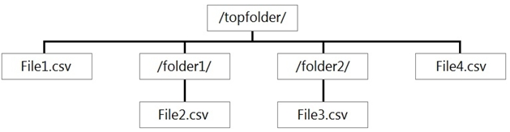

  + Serverless : F1 et F4 
  + Sinon, F1 F2 F3 et F4 (si pas hidden). To change the default and only read from the root folder, set the attribute `<polybase.recursive.traversal>` to 'false' in the core-site.xml configuration file. This file is located under `<SqlBinRoot>\PolyBase\Hadoop\Conf` with SqlBinRoot the `bin` root of SQL Server. For example, `C:\Program Files\Microsoft SQL Server\MSSQL13.XD14\MSSQL\Binn`.

+ Report1: Reads three columns from a file that contains 50 columns. -> Parquet 
  Report2: Queries a single record based on a timestamp. -> Avro gère le timestamp

+ Template recommandé pour vitesse de requête et sécurité : {Region}/{SubjectMatter(s)}/{yyyy}/{mm}/{dd}/{hh}/

+ 

  + Fact -Use hash-distribution with clustered columnstore index. Performance improves when two hash tables are joined on the same distribution column. 
  + Dimension - 
    + Use replicated for smaller tables. 
    + If tables are too large to store on each Compute node, use hash-distributed. 
    + Staging - Use round-robin for the staging table. The load with CTAS is fast. Once the data is in the staging table, use INSERT...SELECT to move the data to production tables.
  + Voir : https://docs.microsoft.com/en-us/azure/synapse-analytics/sql-data-warehouse/sql-data-warehouse-tables-overview#common-distribution-methods-for-tables

+ 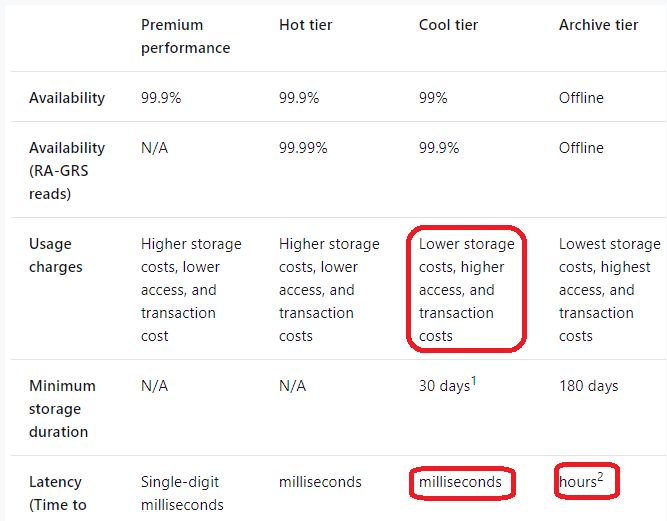

  + **Hot tier** - An online tier optimized for storing data that is accessed or modified frequently. The hot tier has the highest storage costs, but the lowest access costs.
  + **Cool tier** - An online tier optimized for storing data that is infrequently accessed or modified. Data in the cool tier should be stored for a minimum of 30 days. The cool tier has lower storage costs and higher access costs compared to the hot tier.
  + **Archive tier** - An offline tier optimized for storing data that is rarely accessed, and that has flexible latency requirements, on the order of hours. Data in the archive tier should be stored for a minimum of 180 days.

+ 

  + DISTRIBUTION = HASH ( distribution_column_name )      
  + DISTRIBUTION = HASH ( [distribution_column_name [, ...n]] )       
  + DISTRIBUTION = ROUND_ROBIN -- default for Azure Synapse Analytics      
  + DISTRIBUTION = REPLICATE -- default for Parallel Data Warehouse
  + PARTITION ( partition_column_name RANGE [ LEFT | RIGHT ] -- default is LEFT 
    FOR VALUES ( [ boundary_value [,...n] ] ) )

+ SCD : 

  + **Type 0: retain original** : Type 0 dimension attributes never change and are assigned to attributes that have durable values or are described as ‘native’.
  + **Type 1: overwrite** : This method overwrites old data with new data, and therefore does not track historical data.
  + **Type 2: add new row** : This method tracks historical data by creating multiple records for a given natural key in dimensional tables with different surrogate keys and/or different version numbers.
  + **Type 3: add new attribute** : This method tracks changes using separate columns and preserves a limited history.
  + **Type 4: add history table** : The Type 4 method is usually referred to using “history tables”, where one table holds the current data, and an additional table is used to keep a record of some or all of the changes
  + **Type 5 : Technology build** : The Type 5 technology builds on the Type 4 mini-dimension by embedding a “current profile” mini-dimension key in the base dimension which is overwritten as a Type 1 attribute.
  + **Type 6: combined approach** : The type 6 method combines the methods of types 1, 2 and 3 (1 + 2 + 3 = 6). 

+ Masques de sécurité : 

  + The Default masking function: Full masking according to the data types of the designated fields
    + Use a zero value for numeric data types (bigint, bit, decimal, int, money, numeric, smallint, smallmoney, tinyint, float, real).
    + Use 01-01-1900 for date/time data types (date, datetime2, datetime, datetimeoffset, smalldatetime, time).

+ External table : 

  + ```sql
    -- Create a new external table
    CREATE EXTERNAL TABLE { database_name.schema_name.table_name | schema_name.table_name | table_name }
        ( <column_definition> [ ,...n ] )
        WITH (
            LOCATION = 'folder_or_filepath',
            DATA_SOURCE = external_data_source_name,
            [ FILE_FORMAT = external_file_format_name ]
            [ , <reject_options> [ ,...n ] ]
        )
    [;]
    ```

  + ALTER statement is not supported on external table, you need to DROP it and CREATE it again

  + Only these Data Definition Language (DDL) statements are allowed on external tables:
    ✑ CREATE TABLE and DROP TABLE
    ✑ CREATE STATISTICS and DROP STATISTICS
    ✑ CREATE VIEW and DROP VIEW

+ Azure Storage redundancy

  + **Locally redundant storage (LRS)** : 
    + copies your data synchronously three times within a single physical location in the primary region. 
    + 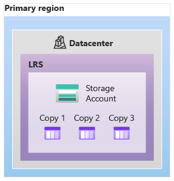
    + 
  + **Zone-redundant storage (ZRS)** : 
    + copies your data synchronously across three Azure availability zones in the primary region. For applications requiring high availability, Microsoft recommends using ZRS in the primary region, and also replicating to a secondary region.
    + 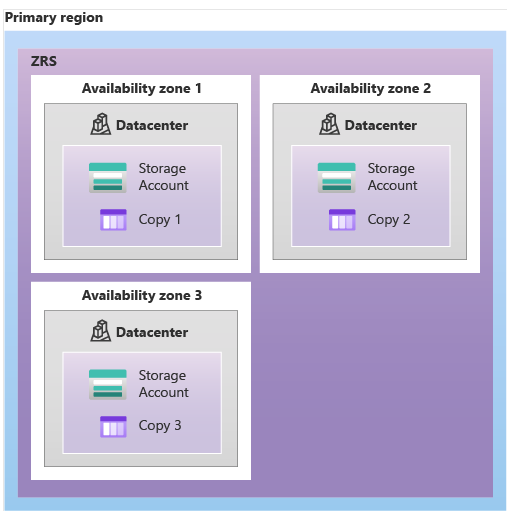
  + **Geo-redundant storage** : 
    + Geo-redundant storage (GRS) copies your data synchronously three times within a single physical location in the primary region using LRS. It then copies your data asynchronously to a single physical location in a secondary region that is hundreds of miles away from the primary region.
    + 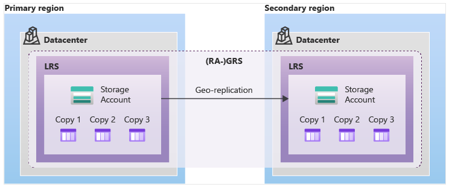
  + **Geo-zone-redundant storage** : 
    + Geo-zone-redundant storage (GZRS) combines the high availability provided by redundancy across availability zones with protection from regional outages provided by geo-replication. Data in a GZRS storage account is copied across three [Azure availability zones](https://learn.microsoft.com/en-us/azure/availability-zones/az-overview) in the primary region and is also replicated to a secondary geographic region for protection from regional disasters.
    + 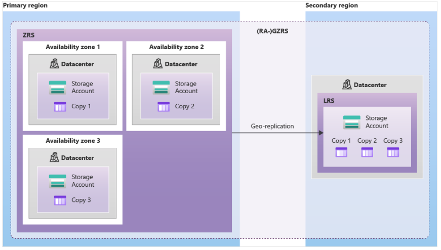
  + **Summary of redundancy options** : 
    + 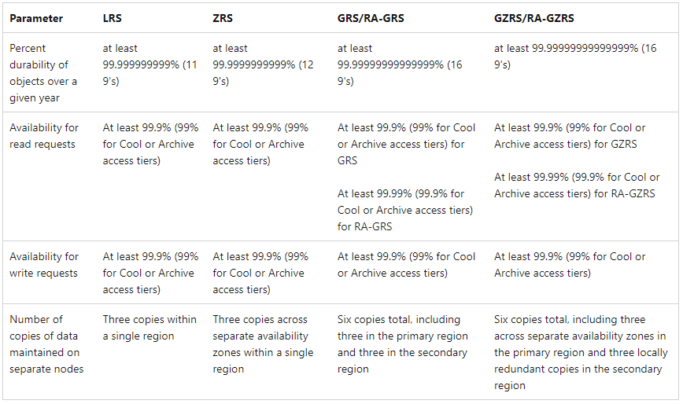
    + 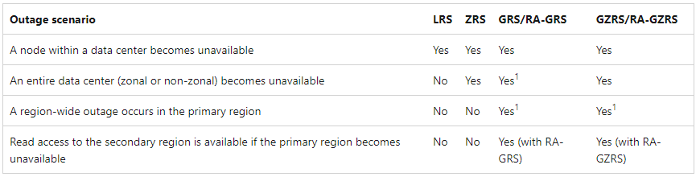
  + **Read Access** : 
    + If your applications require high availability, then you can configure your storage account for read access to the secondary region. When you enable read access to the secondary region, then your data is always available to be read from the secondary, including in a situation where the primary region becomes unavailable. Read-access geo-redundant storage (RA-GRS) or read-access geo-zone-redundant storage (RA-GZRS) configurations permit read access to the secondary region.

+ **Distribution** : 

  + **Hash distributed** : 

    + A hash-distributed table distributes table rows across the Compute nodes by using a deterministic hash function to assign each row to one [distribution](https://learn.microsoft.com/en-us/azure/synapse-analytics/sql-data-warehouse/massively-parallel-processing-mpp-architecture#distributions).

    + In dedicated SQL pool this knowledge is used to minimize data movement during queries, which improves query performance.

    + Hash-distributed tables work well for large fact tables in a star schema. They can have very large numbers of rows and still achieve high performance.

    + Consider using a hash-distributed table when:

      + The table size on disk is more than 2 GB.
      + The table has frequent insert, update, and delete operations.

    + 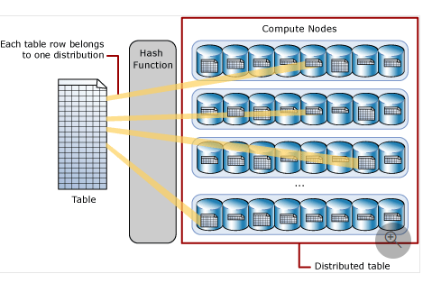

    + Ex. : 

      + ```sql
        CREATE TABLE [dbo].[FactInternetSales]
        (   [ProductKey]            int          NOT NULL
        ,   [OrderDateKey]          int          NOT NULL
        ,   [CustomerKey]           int          NOT NULL
        ,   [PromotionKey]          int          NOT NULL
        ,   [SalesOrderNumber]      nvarchar(20) NOT NULL
        ,   [OrderQuantity]         smallint     NOT NULL
        ,   [UnitPrice]             money        NOT NULL
        ,   [SalesAmount]           money        NOT NULL
        )
        WITH
        (   CLUSTERED COLUMNSTORE INDEX
        ,  DISTRIBUTION = HASH([ProductKey])
        );
        ```

    + Choosing distribution column(s) is an important design decision since the values in the hash column(s) determine how the rows are distributed. The best choice depends on several factors, and usually involves tradeoffs. Once a distribution column or column set is chosen, you cannot change it. If you didn't choose the best column(s) the first time, you can use [CREATE TABLE AS SELECT (CTAS)](https://learn.microsoft.com/en-us/sql/t-sql/statements/create-table-as-select-azure-sql-data-warehouse?toc=/azure/synapse-analytics/sql-data-warehouse/toc.json&bc=/azure/synapse-analytics/sql-data-warehouse/breadcrumb/toc.json&view=azure-sqldw-latest&preserve-view=true) to re-create the table with the desired distribution hash key.

    + **To balance the parallel processing, select a distribution column or set of columns that** : 

      + **Has many unique values**
      + **Does not have NULLs, or has only a few NULLs.**
      + **Is not a date column**

    + **To minimize data movement, select a distribution column or set of columns that:** 

      + **Is used in `JOIN`, `GROUP BY`, `DISTINCT`, `OVER`, and `HAVING` clauses.**
      + **Is *not* used in `WHERE` clauses.**
      + **Is *not* a date column.**

  + **Round-robin distributed** : 

    + A round-robin distributed table distributes table rows evenly across all distributions. The assignment of rows to distributions is random. Unlike hash-distributed tables, rows with equal values are not guaranteed to be assigned to the same distribution.
    + As a result, the system sometimes needs to invoke a data movement operation to better organize your data before it can resolve a query. This extra step can slow down your queries. For example, joining a round-robin table usually requires reshuffling the rows, which is a performance hit.
    + Consider using the round-robin distribution for your table in the following scenarios:
      + When getting started as a simple starting point since it is the default
      + If there is no obvious joining key
      + If there is no good candidate column for hash distributing the table
      + If the table does not share a common join key with other tables
      + If the join is less significant than other joins in the query
      + When the table is a temporary staging table

+ **Partitions**

  + **Partition sizing** : 
    + A successful partitioning scheme usually has tens to hundreds of partitions, not thousands.
    + When creating partitions on **clustered columnstore** tables, it is important to consider how many rows belong to each partition. For optimal compression and performance of clustered columnstore tables, a minimum of 1 million rows per distribution and partition is needed. 

+ **Index**

  + **Clustered columnstore indexes**
    + By default, dedicated SQL pool creates a clustered columnstore index when no index options are specified on a table. Clustered columnstore tables offer both the highest level of data compression and the best overall query performance. Clustered columnstore tables will generally outperform clustered index or heap tables and are usually the best choice for large tables. For these reasons, clustered columnstore is the best place to start when you are unsure of how to index your table.
    + There are a few scenarios where clustered columnstore may not be a good option:
      + Columnstore tables do not support varchar(max), nvarchar(max), and varbinary(max). Consider heap or clustered index instead.
      + Columnstore tables may be less efficient for transient data. Consider heap and perhaps even temporary tables.
      + Small tables with less than 60 million rows. Consider heap tables.
  + **Heap** : 
    + A heap table can be especially useful for loading transient data, such as a staging table, which is transformed into a final table.
    + When you are temporarily landing data in dedicated SQL pool, you may find that using a heap table makes the overall process faster. This is because loads to heaps are faster than to index tables and in some cases the subsequent read can be done from cache. If you are loading data only to stage it before running more transformations, loading the table to heap table is much faster than loading the data to a clustered columnstore table. In addition, loading data to a [temporary table](https://learn.microsoft.com/en-us/azure/synapse-analytics/sql-data-warehouse/sql-data-warehouse-tables-temporary) loads faster than loading a table to permanent storage. After data loading, you can create indexes in the table for faster query performance.
    + Cluster columnstore tables begin to achieve optimal compression once there is more than 60 million rows. For small lookup tables, less than 60 million rows, consider using HEAP or clustered index for faster query performance.

+ **Temps réel** : 
  + Input type = Stream, Function = Geospatial

+ Optimisation de perf : paralleliser Input et Output

+ Tumbling windows are a series of fixed-sized, non-overlapping and contiguous time intervals.

+ Azure Data Factory pipelines can execute SSIS packages. In Azure, the following services and tools will meet the core requirements for pipeline orchestration, control flow, and data movement: Azure Data Factory, Oozie on HDInsight, and SQL Server Integration Services (SSIS).

+ Data Lake Storage Gen1 provides unlimited storage.

+ PolyBase can't load rows that have more than 1,000,000 bytes of data. When you put data into the text files in Azure Blob storage or Azure Data Lake Store, they must have fewer than 1,000,000 bytes of data. This byte limitation is true regardless of the table schema.

+ A **materialized view** is a database object that contains the results of a query. A materialized view is not simply a window on the base table. It is actually a separate object holding data in itself. So query data against a materialized view with different filters should be quick.

+ Each **Spark Parquet or CSV external** table located in Azure Storage is represented with an external table in a dbo schema that corresponds to a serverless SQL pool database.

+ 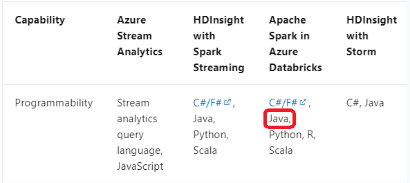

+ 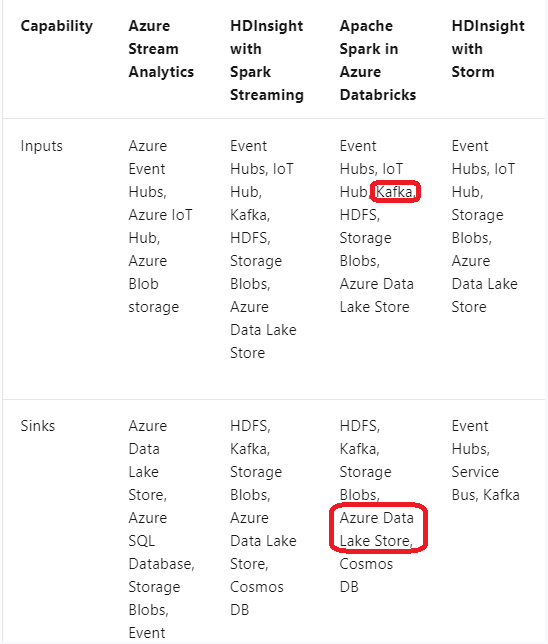

+ **Avro** : 

  + Avro is framework developed within [Apache’s Hadoop project](https://www.adaltas.com/en/tag/apache-hadoop/). It is a row-based storage format which is widely used as a serialization process. AVRO stores its schema in JSON format making it easy to read and interpret by any program. The data itself is stored in binary format by doing it compact and efficient. A key feature of AVRO is related to the fact that it can easily handle schema evolution. It attach metadata into their data in each record.
  + Advantage
    - Avro is a data serialization system.
    - It is splittable (AVRO has a sync marker to separate the block) and compressible.
    - Avro is good file format for data exchange. It has a data storage which is very compact, fast and eficient for analytics.
    - It highly supports schema evolution (at different time and independently).
    - It supports batch and is very relevant for streaming.
    - Avro schemas defined in JSON, easy to read and parse.
    - The data is always accompanied by schema, which allow full processing on the data.
  + Drawback
    - Its data is not readable by human.
    - Not integrated to every languages.
  + Ecosystems
    - Widely used in many application (Kafka, Spark, … ).
    - Avro is a remote procedure call ([RPC](https://en.wikipedia.org/wiki/Remote_procedure_call)).

+ 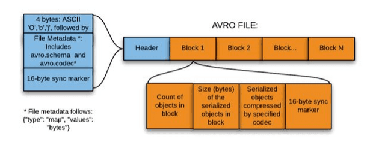

+ For **optimal compression and performance** of clustered columnstore tables, a minimum of 1 million rows per distribution and partition is needed. Before partitions are created, dedicated SQL pool already divides each table into 60 distributed databases.
+ **Hot, cool, and archive access tiers for blob data**
  + **Hot tier** - An online tier optimized for storing data that is accessed or modified frequently. The hot tier has the highest storage costs, but the lowest access costs.
  + **Cool tier** - An online tier optimized for storing data that is infrequently accessed or modified. Data in the cool tier should be stored for a minimum of 30 days. The cool tier has lower storage costs and higher access costs compared to the hot tier.
  + **Archive tier** - An offline tier optimized for storing data that is rarely accessed, and that has flexible latency requirements, on the order of hours. Data in the archive tier should be stored for a minimum of 180 days.
  + Data must remain in the **Archive tier** for at least **180 days** or be subject to an early deletion charge. For example, if a blob is moved to the Archive tier and then deleted or moved to the Hot tier after 45 days, you'll be charged an early deletion fee equivalent to 135 (180 minus 45) days of storing that blob in the Archive tier. A blob in the Cool tier in a general-purpose v2 accounts is subject to an early deletion penalty if it is deleted or moved to a different tier before **30 days** has elapsed. This charge is prorated. For example, if a blob is moved to the Cool tier and then deleted after 21 days, you'll be charged an early deletion fee equivalent to 9 (30 minus 21) days of storing that blob in the Cool tier.

+ Blob storage lifecycle management offers a rule-based policy that you can use to transition your data to the desired access tier when your specified conditions are met. You can also use lifecycle management to expire data at the end of its life.
+ A **natural key / business key** differs from a [surrogate key](https://en.wikipedia.org/wiki/Surrogate_key) which has no meaning outside the database itself and is not based on real-world observation or intended as a statement about the reality being modelled. A natural key therefore provides a certain data quality guarantee whereas a surrogate does not. It is common for elements of data to have several keys, any number of which may be natural or surrogate.
+ **Formes normales**
  + **1NF** : valeurs atomiques 
  + 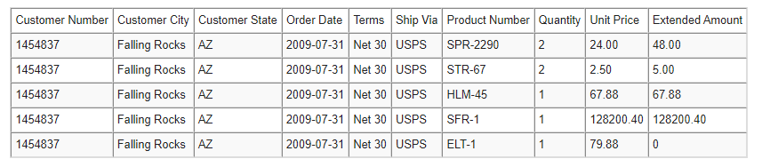
  + **2NF** : Pas de dépendance entre les colonnes --> Tables séparées
  + 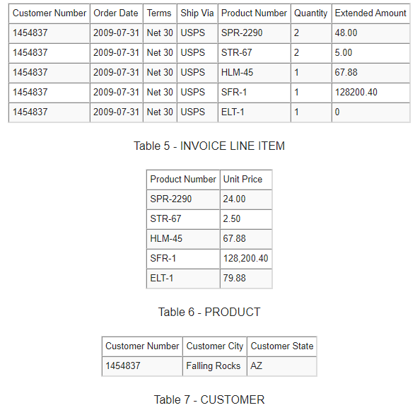
  +  **3NF** : On vire tous les attributs dépendants 
  + 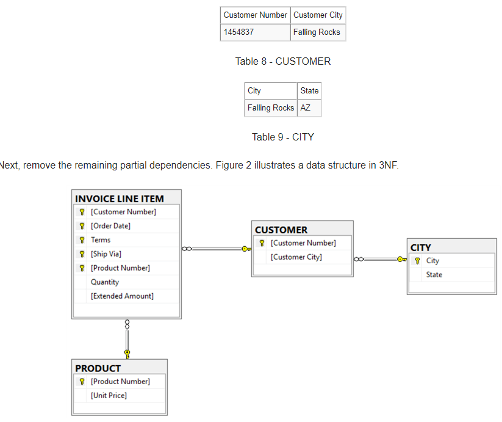

+ **Each partition should have around 1 millions records**. Dedication SQL pools already have 60 partitions.
  + We have the formula: Records/(Partitions*60)= 1 million
    Partitions= Records/(1 million * 60)
    Partitions= 2.4 x 1,000,000,000/(1,000,000 * 60) = 40

+ **build a solution to ensure that users can query specific files in an Azure Data Lake Storage Gen2 account from an Azure Synapse Analytics serverless SQL pool.**
  + You can create external tables in Synapse SQL pools via the following steps:
    + CREATE EXTERNAL DATA SOURCE to reference an external Azure storage and specify the credential that should be used to access the storage.
    + CREATE EXTERNAL FILE FORMAT to describe format of CSV or Parquet files.
    + CREATE EXTERNAL TABLE on top of the files placed on the data source with the same file format.
+ **Dimension tables** contain attribute data that might change but usually changes infrequently. For example, a customer's name and address are stored in a dimension table and updated only when the customer's profile changes. To minimize the size of a large fact table, the customer's name and address don't need to be in every row of a fact table. Instead, the fact table and the dimension table can share a customer ID. A query can join the two tables to associate a customer's profile and transactions.
+ **Fact tables** contain quantitative data that are commonly generated in a transactional system, and then loaded into the dedicated SQL pool. For example, a retail business generates sales transactions every day, and then loads the data into a dedicated SQL pool fact table for analysis.
  Reference:
+ **implementing a pattern that batch loads the files daily into a dedicated SQL pool in Azure Synapse Analytics by using PolyBase.**
  +  Create an **external data source** that uses the abfs location : Create External Data Source to reference Azure Data Lake Store Gen 1 or 2
  + Create an **external file format** and set the *First_Row* option. : Create External File Format.
  + Use **CREATE EXTERNAL TABLE AS SELECT** (CETAS) and configure the reject options to specify reject values or percentages : To use PolyBase, you must create external tables to reference your external data. Use reject options.
    + REJECT options don't apply at the time this CREATE EXTERNAL TABLE AS SELECT statement is run. Instead, they're specified here so that the database can use them at a later time when it imports data from the external table. Later, when the CREATE TABLE AS SELECT statement selects data from the external table, the database will use the reject options to determine the number or percentage of rows that can fail to import before it stops the import.

+ **Pyspark**

  + **explode** 

    + ```python
      explode(expr)
      ```

    + **Arguments** : `expr`: An ARRAY or MAP expression.

    + **Returns** : A set of rows composed of the other expressions in the select list and either the elements of the array or the keys and values of the map. If `expr` is NULL no rows are produced.

    + `explode` can only be placed in the select list or a LATERAL VIEW. When placing the function in the `SELECT` list there must be no other generator function in the same `SELECT` list.

    + The column produced by explode of an array is named `col` by default, but can be aliased. The columns for a map are by default called `key` and `value`. They can also be aliased using an alias tuple such as `AS (myKey, myValue)`.

    + **Exemples** : 

    + ```sql
      > SELECT explode(array(10, 20)) AS elem, 'Spark';
       10 Spark
       20 Spark
      
      > SELECT explode(map(1, 'a', 2, 'b')) AS (num, val), 'Spark';
       1   a   Spark
       2   b   Spark
      
      > SELECT explode(array(1, 2)), explode(array(3, 4));
        Error: unsupported generator
      ```

+ You can use Databricks Pools to Speed up your Data Pipelines and Scale Clusters Quickly.
  Databricks Pools, a managed cache of virtual machine instances that enables clusters to start and scale 4 times faster.

+ Streaming Units (SUs) represents the computing resources that are allocated to execute a Stream Analytics job. The higher the number of SUs, the more CPU and memory resources are allocated for your job.

  + In general, the best practice is to start with 6 SUs for queries that don't use PARTITION BY.
  + Here there are 10 partitions, so 6x10 = 60 SUs is good.
+ **Azure Spark SQL Type 2 SCD** : 
  + The Delta provides the ability to infer the schema for data input which further reduces the effort required in managing the schema changes. The Slowly Changing
Data(SCD) Type 2 records all the changes made to each key in the dimensional table. These operations require updating the existing rows to mark the previous values of the keys as old and then inserting new rows as the latest values. Also, Given a source table with the updates and the target table with dimensional data,
SCD Type 2 can be expressed with the merge.

```python 
customersTable
  .as("customers")
  .merge(
    stagedUpdates.as("staged_updates"),
    "customers.customerId = mergeKey")
  .whenMatched("customers.current = true AND customers.address <> staged_updates.address")
  .updateExpr(Map(                    
    "current" -> "false",
    "endDate" -> "staged_updates.effectiveDate"))
  .whenNotMatched()
  .insertExpr(Map(
    "customerid" -> "staged_updates.customerId",
    "address" -> "staged_updates.address",
    "current" -> "true",
    "effectiveDate" -> "staged_updates.effectiveDate",  
    "endDate" -> "null"))
  .execute()
```

+ PolyBase is a technology that accesses external data stored in Azure Blob storage or Azure Data Lake Store via the T-SQL language.
+ Extract, Load, and Transform (ELT)
+ Extract, Load, and Transform (ELT) is a process by which data is extracted from a source system, loaded into a data warehouse, and then transformed.
+ The basic steps for implementing a PolyBase ELT for dedicated SQL pool are:
  + Extract the source data into text files.
  + Land the data into Azure Blob storage or Azure Data Lake Store.
  + Prepare the data for loading.
  + Load the data into dedicated SQL pool staging tables using PolyBase.
  + Transform the data.
  + Insert the data into production tables.
+ Polybase loads rows that are smaller than 1 MB.
+ **Tumbling windows** 
  + Tumbling windows are a series of fixed-sized, non-overlapping and contiguous time intervals. The following diagram illustrates a stream with a series of events and how they are mapped into 10-second tumbling windows.
  + 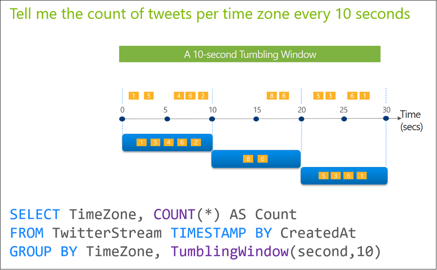
```sql
{TUMBLINGWINDOW | TUMBLING} ( timeunit  , windowsize, [offsetsize] )  
{TUMBLINGWINDOW | TUMBLING} ( Duration( timeunit  , windowsize ), [Offset(timeunit  , offsetsize)] )
```

Exemple : 

```sql
SELECT System.Timestamp() AS WindowEnd, TollId, COUNT(*)  
FROM Input TIMESTAMP BY EntryTime  
GROUP BY TollId, TumblingWindow(Duration(hour, 1), Offset(millisecond, -1))
```
+ **Hopping window**
  + Unlike tumbling windows, hopping windows model scheduled overlapping windows. A hopping window specification consist of three parameters: the timeunit, the windowsize (how long each window lasts) and the hopsize (by how much each window moves forward relative to the previous one). Additionally, offsetsize may be used as an optional fourth parameter. Note that a tumbling window is simply a hopping window whose ‘hop’ is equal to its ‘size’.
  + 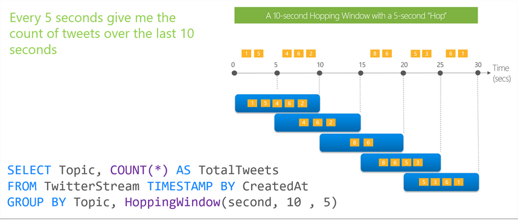
```sql
{HOPPINGWINDOW | HOPPING} ( timeunit  , windowsize , hopsize, [offsetsize] )
{HOPPINGWINDOW | HOPPING} ( Duration( timeunit  , windowsize ) , Hop (timeunit  , windowsize ), [Offset(timeunit  , offsetsize)])
```
